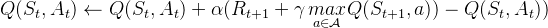
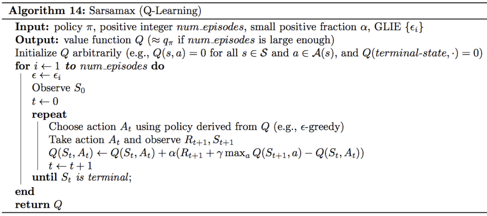
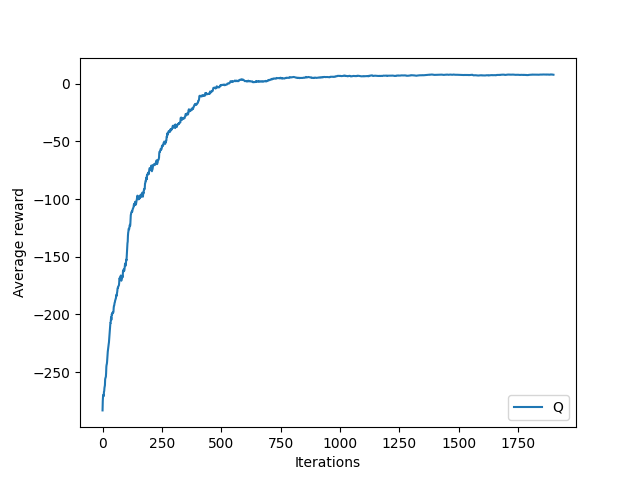
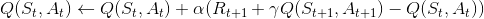
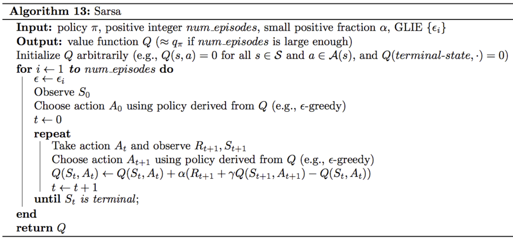
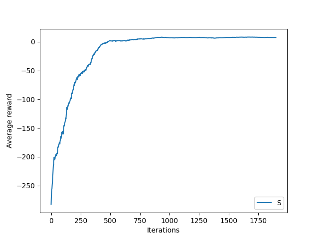
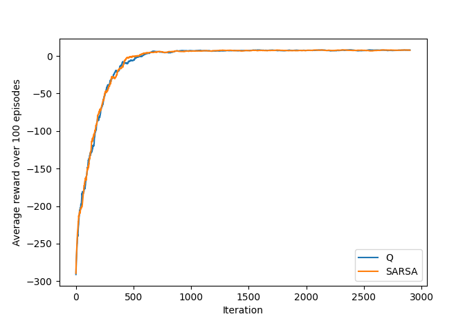

Solving OpenAI gym environment using various algorithms such as:

- Q-Learning
- SARSA

We seek a policy that maximizes the total reward per episode. 
There are 500 possible states: 25 squares, 5 locations for the passenger and 4 destinations.

Q-Learning update rule:

Pseudocode:

Performance of Q-Learning on the Taxi-v3 agent:

Sarsa update rule:

The action-value update uses the State, Action, Reward, next State, next Reward.
Pseudocode:

Performance of Sarsa on the Taxi-v3 agent:

Comparing Q Learning vs Sarsa:

Performance of Q-Learning on the Taxi-v3 agent:

The resulting graph is noisier for Q-Learning than Sarsa, and this is because we are averaging over all the possible actions in the next state. Convergence takes more time and there are gradually some small improvement in Sarsa.
